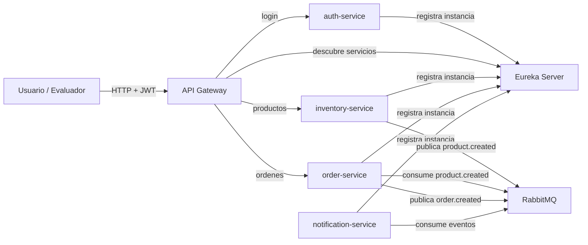
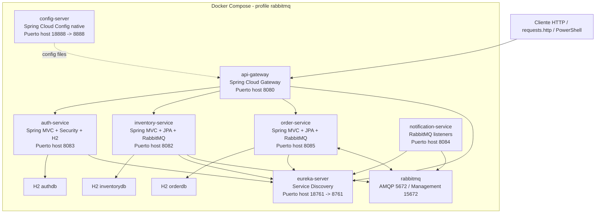
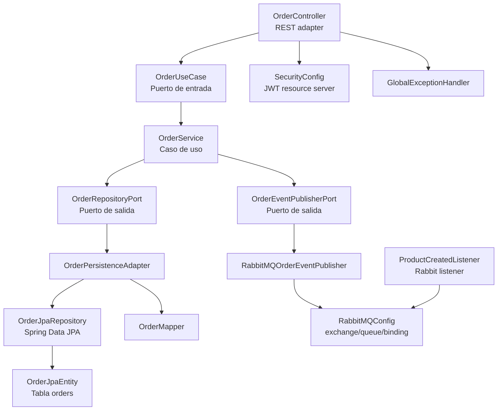

# Software Architecture Document (SAD)

## Trabajo Practico: Arquitectura de Aplicaciones

**Proyecto:** Ecosistema de microservicios UADE  
**Materia:** Arquitectura de Aplicaciones  
**Cuatrimestre:** Primer cuatrimestre de 2026  
**Grupo:** Grupo 11  
**Version:** 1.0  
**Fecha:** 8 de junio de 2026  

---

## 1. Proposito y alcance

Este documento describe la arquitectura del ecosistema de microservicios extendido para el Trabajo Practico de Arquitectura de Aplicaciones. El objetivo del TP es partir de un ecosistema base y demostrar, mediante una prueba de concepto ejecutable, la integracion de un nuevo microservicio simple dentro de una arquitectura distribuida.

La extension implementada agrega `order-service`, un microservicio de ordenes que expone endpoints REST protegidos con JWT, se registra en Eureka, se publica a traves del API Gateway, persiste una entidad propia y participa en comunicacion asincronica mediante RabbitMQ. El servicio consume eventos de inventario (`product.created`) y publica eventos de orden (`order.created`) que son consumidos por `notification-service`.

El alcance tecnico obligatorio del TP queda cubierto por los siguientes elementos:

- Ejecucion del ecosistema base con perfil `rabbitmq`.
- Microservicios independientes con Spring Boot 3.4 y Java 21.
- API Gateway con Spring Cloud Gateway.
- Service Discovery con Eureka.
- Seguridad con JWT emitido por `auth-service`.
- Broker de mensajeria RabbitMQ.
- Nuevo microservicio `order-service` integrado.
- Persistencia por microservicio con H2 en memoria.
- Comunicacion asincronica con publicacion y consumo de eventos.

Docker, Zipkin y ELK son opcionales segun la consigna. En esta PoC Docker se utiliza para reproducibilidad del entorno. Zipkin y ELK quedan disponibles como perfiles opcionales, pero no forman parte del camino obligatorio de aprobacion.

## 2. Resumen ejecutivo

La arquitectura implementada sigue un enfoque de microservicios con responsabilidades separadas, descubrimiento dinamico y comunicacion sincrona/asincrona. Los clientes no invocan directamente los servicios de negocio en el flujo recomendado, sino que ingresan por `api-gateway`. El gateway valida la autenticacion JWT y enruta hacia los servicios internos registrados en Eureka.

El nuevo `order-service` cumple los requisitos principales de la consigna:

- Se registra en Eureka con el nombre `order-service`.
- Expone endpoints REST bajo `/api/orders`.
- Requiere JWT valido para operar.
- Persiste la entidad `Order` en su propia base H2.
- Consume eventos `product.created` desde RabbitMQ.
- Publica eventos `order.created` hacia RabbitMQ.
- Es integrado al `notification-service`, que consume la notificacion de orden creada.

La arquitectura favorece desacoplamiento mediante puertos y adaptadores en los servicios de dominio (`inventory-service` y `order-service`). El caso de uso no conoce los detalles de RabbitMQ ni de JPA: esos detalles viven en adaptadores de infraestructura que implementan puertos definidos por el dominio/aplicacion.

## 3. Contexto del sistema

El sistema representa un ecosistema de servicios para demostrar operaciones basicas de inventario, autenticacion, ordenes y notificaciones. Los usuarios autentican contra `auth-service`, obtienen un token JWT y luego operan contra el API Gateway. El gateway valida el token y enruta hacia el servicio correspondiente.

### 3.1 Actores

| Actor | Descripcion | Interaccion principal |
|---|---|---|
| Usuario administrador | Persona que prueba o administra la PoC. | Login, creacion de productos, creacion y consulta de ordenes. |
| Usuario comun | Persona con acceso autenticado limitado. | Consulta o creacion de recursos permitidos por su rol. |
| API Gateway | Punto unico de entrada HTTP. | Valida JWT, enruta y propaga `Authorization`. |
| Eureka Server | Registro de servicios. | Mantiene instancias disponibles para enrutamiento. |
| RabbitMQ | Broker de eventos. | Desacopla productores y consumidores asincronicos. |
| Notification Service | Consumidor de eventos. | Registra/loguea notificaciones derivadas de eventos. |

### 3.2 Sistemas externos y dependencias

| Sistema/dependencia | Rol | Obligatorio |
|---|---|---|
| Docker Compose | Orquestacion local de la PoC. | No por consigna, si para reproducibilidad. |
| RabbitMQ | Broker de mensajeria usado por el perfil obligatorio. | Si. |
| H2 Database | Persistencia en memoria por servicio. | Si, para PoC. |
| Zipkin | Observabilidad de trazas distribuidas. | Opcional. |
| ELK | Logs centralizados. | Opcional. |

## 4. C1 - Context

### 4.1 Diagrama C1



### 4.2 Descripcion C1

El sistema completo se ubica entre el usuario/evaluador y un conjunto de servicios internos. El usuario interactua con el sistema mediante HTTP. La autenticacion ocurre con usuario y password contra `auth-service`; el resultado es un JWT. A partir de ese momento, todas las operaciones protegidas se ejecutan enviando `Authorization: Bearer <token>` al `api-gateway`.

El `api-gateway` actua como frontera del sistema. Aplica seguridad, mantiene un contrato de rutas estable y desacopla a los clientes de los puertos internos de cada microservicio. Eureka resuelve la ubicacion de servicios por nombre logico, lo que evita acoplar rutas a host/puerto fijos dentro de la red Docker.

RabbitMQ permite que los servicios no tengan que llamarse directamente para informar cambios de estado. `inventory-service` publica un evento cuando se crea un producto, `order-service` lo consume para demostrar integracion asincronica de entrada, y a su vez `order-service` publica `order.created`, que `notification-service` consume para demostrar integracion de salida.

## 5. C2 - Containers

### 5.1 Diagrama C2



### 5.2 Contenedores principales

| Contenedor | Tecnologia | Responsabilidad | Puerto host |
|---|---|---|---|
| `config-server` | Spring Cloud Config Server | Servir configuracion centralizada con perfil `native`. | 18888 -> 8888 |
| `eureka-server` | Netflix Eureka | Registro y descubrimiento de servicios. | 18761 -> 8761 |
| `api-gateway` | Spring Cloud Gateway, WebFlux Security | Entrada unica, validacion JWT, ruteo a servicios. | 8080 |
| `auth-service` | Spring Boot MVC, Spring Security, JPA, H2 | Login, usuarios, roles, emision de JWT. | 8083 |
| `inventory-service-rabbitmq` | Spring Boot MVC, JPA, H2, AMQP | Gestion de productos y publicacion `product.created`. | 8082 |
| `order-service-rabbitmq` | Spring Boot MVC, JPA, H2, AMQP | Gestion de ordenes, consumo y publicacion de eventos. | 8085 |
| `notification-service-rabbitmq` | Spring Boot, AMQP | Consumo y log de eventos de productos y ordenes. | 8084 |
| `rabbitmq` | RabbitMQ management alpine | Broker AMQP y consola de administracion. | 5672, 15672 |

### 5.3 Comunicacion entre contenedores

La comunicacion sincrona usa HTTP:

- `api-gateway` -> `auth-service` para login.
- `api-gateway` -> `inventory-service` para productos.
- `api-gateway` -> `order-service` para ordenes.
- Servicios -> `eureka-server` para registro y renovacion de heartbeat.

La comunicacion asincronica usa AMQP/RabbitMQ:

- `inventory-service` publica `product.created` en `inventory.exchange`.
- `order-service` consume `product.created` desde `order.product.created.queue`.
- `order-service` publica `order.created` en `order.exchange`.
- `notification-service` consume `order.created` desde `order.created.queue`.
- `notification-service` tambien consume `product.created` desde `product.created.queue`.

### 5.4 Puertos alternativos

En la PoC Docker se publican `config-server` y `eureka-server` en puertos alternativos de host para evitar colisiones con procesos locales:

- Config Server: `localhost:18888` hacia `8888` interno.
- Eureka Server: `localhost:18761` hacia `8761` interno.

Dentro de la red Docker se mantienen los puertos internos originales (`config-server:8888`, `eureka-server:8761`), por lo que la arquitectura interna no cambia.

## 6. C3 - Components

El nivel C3 se enfoca especialmente en el nuevo microservicio `order-service`, porque es el componente agregado para cumplir la consigna.

### 6.1 C3 de order-service



### 6.2 Componentes de order-service

| Componente | Archivo principal | Responsabilidad |
|---|---|---|
| Aplicacion | `OrderServiceApplication.java` | Bootstrap Spring Boot y Eureka Client. |
| Controlador REST | `OrderController.java` | Expone `POST /api/orders`, `GET /api/orders`, `GET /api/orders/{id}`. |
| DTO de entrada | `CreateOrderRequest.java` | Modela `productId` y `quantity`. |
| Puerto de entrada | `OrderUseCase.java` | Define operaciones de negocio disponibles. |
| Servicio de aplicacion | `OrderService.java` | Crea ordenes, consulta ordenes y publica eventos. |
| Modelo de dominio | `Order.java` | Representa la orden sin depender de JPA. |
| Evento de dominio | `OrderCreatedEvent.java` | Payload publicado al crear una orden. |
| Evento de entrada | `ProductCreatedEvent.java` | Payload consumido desde inventario. |
| Puerto de persistencia | `OrderRepositoryPort.java` | Abstraccion de almacenamiento. |
| Adaptador JPA | `OrderPersistenceAdapter.java` | Implementa el puerto usando Spring Data JPA. |
| Entidad JPA | `OrderJpaEntity.java` | Tabla `orders` en H2. |
| Mapper | `OrderMapper.java` | Traduce entre dominio y entidad JPA. |
| Repositorio JPA | `OrderJpaRepository.java` | Operaciones de base de datos. |
| Puerto de eventos | `OrderEventPublisherPort.java` | Abstraccion de publicacion de eventos. |
| Publicador RabbitMQ | `RabbitMQOrderEventPublisher.java` | Publica `order.created`. |
| Listener RabbitMQ | `ProductCreatedListener.java` | Consume `product.created`. |
| Configuracion RabbitMQ | `RabbitMQConfig.java` | Declara exchange, queue y binding. |
| Seguridad | `SecurityConfig.java` | Valida JWT con la clave compartida. |
| Manejo de errores | `GlobalExceptionHandler.java` | Respuestas consistentes ante errores de acceso. |

### 6.3 Componentes de inventory-service

`inventory-service` gestiona productos y publica el evento `product.created`. Tambien sigue un estilo de puertos y adaptadores:

- `InventoryController`: adaptador REST.
- `ProductUseCase`: puerto de entrada.
- `ProductService`: caso de uso.
- `ProductRepositoryPort`: puerto de persistencia.
- `ProductPersistenceAdapter`, `ProductJpaRepository`, `ProductJpaEntity`: persistencia.
- `EventPublisherPort`: puerto de eventos.
- `RabbitMQPublisherAdapter`: publicador RabbitMQ.
- `RabbitMQConfig`: exchange `inventory.exchange`, queue `product.created.queue`, routing key `product.created`.
- `SecurityConfig`: validacion JWT en endpoints `/api/inventory/**`.

### 6.4 Componentes de notification-service

`notification-service` es un consumidor de eventos. No persiste datos en la PoC; registra por log la llegada de eventos:

- `ProductEventListener`: consume `product.created`.
- `OrderEventListener`: consume `order.created`.
- `RabbitMQConfig`: declara las colas y bindings necesarios.
- DTOs `ProductCreatedEvent` y `OrderCreatedEvent`: estructura de mensajes recibidos.

### 6.5 Componentes de api-gateway

`api-gateway` concentra el acceso HTTP:

- `SecurityConfig`: define rutas publicas y protegidas, y valida JWT.
- `AuthorizationHeaderGatewayFilterFactory`: propaga el header `Authorization` hacia servicios downstream.
- Configuracion de rutas:
  - `/auth/**` -> `auth-service`.
  - `/api/inventory/**` -> `inventory-service`.
  - `/api/orders` y `/api/orders/**` -> `order-service`.

## 7. Vista de datos

Cada microservicio mantiene su propia base H2 en memoria, evitando una base compartida. Esto respeta el principio de autonomia de datos por servicio, aunque sea una persistencia temporal adecuada para PoC.

### 7.1 Modelo auth-service

| Entidad | Descripcion |
|---|---|
| `User` | Usuario con credenciales, password hasheada y roles. |
| `Role` | Roles como `ADMIN` y `USER`. |

### 7.2 Modelo inventory-service

| Entidad | Campos principales | Descripcion |
|---|---|---|
| `Product` | `id`, `name`, `quantity`, `price` | Producto disponible en inventario. |

### 7.3 Modelo order-service

| Entidad | Campos principales | Descripcion |
|---|---|---|
| `Order` | `id`, `productId`, `quantity`, `status`, `createdAt`, `username` | Orden creada por un usuario autenticado. |

La tabla JPA concreta se llama `orders`, porque `order` puede ser palabra reservada en motores SQL. La entidad de dominio `Order` se mantiene separada de `OrderJpaEntity` para evitar acoplar reglas de negocio a detalles de persistencia.

## 8. Vista de seguridad

La seguridad se basa en JWT simetrico con algoritmo HS384. `auth-service` emite el token y los servicios protegidos lo validan usando la misma clave configurada en sus `application.yml`.

### 8.1 Flujo de autenticacion

1. El cliente ejecuta `POST /auth/login` contra `api-gateway`.
2. El gateway permite la ruta `/auth/**` sin token.
3. `auth-service` valida usuario/password contra H2.
4. `auth-service` genera un JWT con subject y roles.
5. El cliente usa `Authorization: Bearer <token>` para llamadas posteriores.
6. `api-gateway`, `inventory-service` y `order-service` validan el JWT.

### 8.2 Roles y autorizacion

En la PoC existen dos usuarios iniciales:

| Usuario | Password | Roles |
|---|---|---|
| `admin` | `admin123` | `ADMIN`, `USER` |
| `user` | `user123` | `USER` |

`order-service` utiliza el subject del JWT como `username` de la orden. Para consultas, un usuario administrador puede ver todas las ordenes; un usuario comun queda restringido a las ordenes asociadas a su usuario.

### 8.3 Propagacion del token

El gateway valida el JWT y luego propaga explicitamente el header `Authorization` mediante `AuthorizationHeaderGatewayFilterFactory`. Esto permite que los servicios downstream apliquen tambien su propia validacion como resource servers.

## 9. Vista de eventos

### 9.1 Eventos

| Evento | Productor | Consumidor | Exchange | Routing key | Cola |
|---|---|---|---|---|---|
| `product.created` | `inventory-service` | `notification-service` | `inventory.exchange` | `product.created` | `product.created.queue` |
| `product.created` | `inventory-service` | `order-service` | `inventory.exchange` | `product.created` | `order.product.created.queue` |
| `order.created` | `order-service` | `notification-service` | `order.exchange` | `order.created` | `order.created.queue` |

### 9.2 Flujo de producto creado

1. Cliente crea un producto en `POST /api/inventory/products`.
2. `inventory-service` persiste el producto en H2.
3. `inventory-service` publica `ProductCreatedEvent`.
4. RabbitMQ entrega el evento a colas enlazadas.
5. `notification-service` consume el evento y registra una notificacion.
6. `order-service` consume el evento y registra la recepcion.

### 9.3 Flujo de orden creada

1. Cliente crea una orden en `POST /api/orders`.
2. `order-service` toma el usuario desde el JWT.
3. `order-service` persiste `Order`.
4. `order-service` publica `OrderCreatedEvent`.
5. `notification-service` consume el evento y registra la notificacion de orden.

## 10. ASRs - Architecturally Significant Requirements

### ASR-01 - Despliegue reproducible

El ecosistema debe ejecutarse de forma repetible con `docker compose --profile rabbitmq up --build -d`. Este requisito es significativo porque una arquitectura distribuida con multiples servicios puede fallar por orden de arranque, puertos ocupados o dependencias no disponibles.

**Decision asociada:** uso de `depends_on` con `condition: service_healthy` y healthchecks por servicio.

### ASR-02 - Descubrimiento dinamico de servicios

Los servicios deben registrarse en Eureka y ser localizables por nombre logico. Esto evita acoplamiento del gateway a direcciones estaticas.

**Decision asociada:** uso de Eureka Client en `auth-service`, `api-gateway`, `inventory-service`, `order-service` y `notification-service`.

### ASR-03 - Seguridad end-to-end con JWT

Los endpoints de negocio deben requerir un token emitido por `auth-service`. Este requisito afecta gateway, servicios downstream y contratos de prueba.

**Decision asociada:** JWT HS384 con clave compartida en servicios protegidos y filtro de propagacion de `Authorization` en el gateway.

### ASR-04 - Mensajeria asincronica obligatoria

El nuevo microservicio debe publicar y consumir al menos un evento. Este requisito define parte de la arquitectura de integracion.

**Decision asociada:** RabbitMQ como broker obligatorio del perfil principal; exchanges y colas separadas para productos y ordenes.

### ASR-05 - Persistencia por microservicio

El nuevo microservicio debe tener una entidad persistida. Para la PoC se prioriza simplicidad y velocidad de arranque.

**Decision asociada:** H2 en memoria por servicio y JPA para persistencia.

### ASR-06 - Bajo acoplamiento entre negocio e infraestructura

Los servicios de negocio no deben depender directamente de JPA o RabbitMQ en su nucleo de caso de uso.

**Decision asociada:** puertos y adaptadores en `inventory-service` y `order-service`.

### ASR-07 - Observabilidad basica

La PoC debe permitir comprobar arranque, health y eventos con comandos y logs. Zipkin/ELK son opcionales, pero la consola debe ser suficiente para demostrar el flujo.

**Decision asociada:** healthchecks Docker, logs de eventos, y perfiles opcionales `zipkin` y `elk`.

## 11. Decisiones arquitectonicas

### ADR-01 - Usar microservicios Spring Boot Maven multi-modulo

**Contexto:** La consigna parte de un ecosistema base de microservicios.  
**Decision:** Mantener un repositorio multi-modulo Maven con un modulo por servicio.  
**Consecuencias:** Facilita compilar todo con `mvn package -DskipTests` y compartir version de Spring Boot/Spring Cloud. A cambio, todos los servicios viven en un mismo repositorio, lo cual es adecuado para una PoC academica pero no necesariamente para una organizacion con equipos independientes.

### ADR-02 - Usar RabbitMQ como broker principal

**Contexto:** La consigna exige RabbitMQ para aprobar.  
**Decision:** Definir `rabbitmq` como perfil de ejecucion principal.  
**Consecuencias:** El flujo obligatorio es liviano y simple de demostrar. Kafka queda como alternativa opcional ya presente en el proyecto.

### ADR-03 - Integrar order-service al gateway por rutas explicitas

**Contexto:** El nuevo microservicio debe ser accesible desde la arquitectura y no solo por puerto directo.  
**Decision:** Agregar rutas `/api/orders` y `/api/orders/**` hacia `lb://order-service`.  
**Consecuencias:** Los clientes usan el gateway como punto unico. El enrutamiento depende de Eureka y del registro correcto del servicio.

### ADR-04 - Validar JWT en gateway y servicios downstream

**Contexto:** El gateway podria ser el unico punto de seguridad, pero los servicios quedarian debiles ante llamadas directas.  
**Decision:** Validar JWT en gateway y tambien en `inventory-service` y `order-service`.  
**Consecuencias:** Mayor defensa en profundidad. Requiere mantener la clave JWT sincronizada en los servicios.

### ADR-05 - Usar H2 en memoria para persistencia

**Contexto:** La consigna pide una entidad persistida, no una base productiva.  
**Decision:** Usar H2 en memoria por microservicio.  
**Consecuencias:** Arranque simple y sin dependencias externas. Los datos se pierden al reiniciar, lo cual es aceptable para PoC pero no para produccion.

### ADR-06 - Aplicar puertos y adaptadores

**Contexto:** Se busca mostrar una arquitectura clara y extensible.  
**Decision:** Separar dominio, puertos y adaptadores en servicios de negocio.  
**Consecuencias:** Permite reemplazar persistencia o broker con menor impacto. Agrega algo de estructura y clases extra, justificable por fines academicos.

### ADR-07 - Separar perfiles opcionales de Zipkin y ELK

**Contexto:** Zipkin y ELK son opcionales y pueden consumir recursos o puertos.  
**Decision:** Mover Zipkin a perfil `zipkin` y ELK a perfil `elk`.  
**Consecuencias:** El perfil obligatorio `rabbitmq` queda liviano y evita fallos por puertos ocupados como `9411`.

### ADR-08 - Usar puertos alternativos para Config Server y Eureka en host

**Contexto:** En el entorno de prueba los puertos `8888` y `8761` estaban ocupados.  
**Decision:** Publicar `config-server` como `18888:8888` y `eureka-server` como `18761:8761`.  
**Consecuencias:** Se evitan colisiones locales sin modificar la comunicacion interna de Docker.

## 12. Riesgos

| Riesgo | Impacto | Probabilidad | Mitigacion |
|---|---:|---:|---|
| Puertos ocupados en el host | Alto | Media | Uso de puertos alternativos para Config/Eureka; documentar comandos de diagnostico. |
| RabbitMQ falla por volumen/cookie con permisos | Alto | Media | Volumen nombrado `rabbitmq-data`, `RABBITMQ_ERLANG_COOKIE` fija y limpieza con `down -v` si es necesario. |
| JWT con clave desincronizada | Alto | Baja | Mantener la misma clave en `auth-service`, gateway y servicios protegidos. |
| Falta de evidencia de eventos por logging mal configurado | Medio | Media | Activar appender consola para perfiles `rabbitmq,kafka`. |
| Perdida de datos al reiniciar | Medio | Alta | Aceptado por PoC; documentar que H2 en memoria no es persistencia productiva. |
| Acoplamiento por DTOs duplicados de eventos | Medio | Media | Mantener contratos simples y versionables; para produccion evaluar libreria de contratos o schema registry. |
| Ordenes sin validacion real de stock | Medio | Media | Fuera de alcance; para evolucion integrar consulta/validacion de inventario. |
| Broker no disponible | Alto | Baja | Healthchecks y `depends_on`; reintentos propios de Spring AMQP. |
| Observabilidad opcional no levantada | Bajo | Media | No afecta aprobacion; perfiles separados para Zipkin/ELK. |
| Repositorio mono-modulo operativo | Bajo | Media | Aceptado para TP; en produccion evaluar repos por bounded context. |

## 13. Evidencia de PoC

### 13.1 Arranque Docker

Comando principal:

```powershell
docker compose --profile rabbitmq up --build -d
```

Resultado validado:

- `api-gateway`: healthy.
- `auth-service`: healthy.
- `config-server`: healthy.
- `eureka-server`: healthy.
- `inventory-service-rabbitmq`: healthy.
- `notification-service-rabbitmq`: healthy.
- `order-service-rabbitmq`: healthy.
- `rabbitmq`: healthy.

### 13.2 Login y JWT

Comando:

```powershell
$login = Invoke-RestMethod -Method Post `
  -Uri http://localhost:8080/auth/login `
  -ContentType "application/json" `
  -Body '{"username":"admin","password":"admin123"}'

$token = "Bearer " + $login.token
```

Resultado esperado: token JWT valido tipo Bearer.

### 13.3 Creacion de producto

Comando:

```powershell
Invoke-RestMethod -Method Post `
  -Uri http://localhost:8080/api/inventory/products `
  -Headers @{ Authorization = $token } `
  -ContentType "application/json" `
  -Body '{"name":"Producto Docker","quantity":10,"price":99.99}'
```

Resultado observado:

```text
id name            quantity price
-- ----            -------- -----
 4 Producto Docker       10 99,99
```

### 13.4 Creacion de orden

Comando:

```powershell
Invoke-RestMethod -Method Post `
  -Uri http://localhost:8080/api/orders `
  -Headers @{ Authorization = $token } `
  -ContentType "application/json" `
  -Body '{"productId":1,"quantity":2}'
```

Resultado observado:

```text
id        : 1
productId : 1
quantity  : 2
status    : CREATED
username  : admin
```

### 13.5 Registro en Eureka

En los logs se observan registros exitosos:

```text
DiscoveryClient_ORDER-SERVICE/... registration status: 204
DiscoveryClient_INVENTORY-SERVICE/... registration status: 204
DiscoveryClient_NOTIFICATION-SERVICE/... registration status: 204
```

### 13.6 Evidencia de RabbitMQ

En los logs se observa conexion AMQP exitosa:

```text
Created new connection: ... [delegate=amqp://guest@rabbitmq:5672/]
```

Para evidencia final de eventos se recomienda capturar:

```powershell
docker compose --profile rabbitmq logs --tail=200 inventory-service-rabbitmq order-service-rabbitmq notification-service-rabbitmq
```

Lineas esperadas:

```text
Evento publicado: ProductCreated
Evento consumido en order-service: product.created
Evento publicado: order.created
NOTIFICACION DE ORDEN RECIBIDA
```

## 14. Trazabilidad contra la consigna

| Requisito de consigna | Estado | Evidencia |
|---|---|---|
| Clonar y ejecutar ecosistema base con perfil RabbitMQ | Cumplido | `docker compose --profile rabbitmq ps` con servicios healthy. |
| Crear microservicio nuevo | Cumplido | `order-service`. |
| Exponer 1 endpoint REST | Cumplido | `POST /api/orders`, `GET /api/orders`, `GET /api/orders/{id}`. |
| Integrar a Eureka | Cumplido | Registro `ORDER-SERVICE` con status 204. |
| Integrar a API Gateway | Cumplido | Ruta `/api/orders` hacia `lb://order-service`. |
| Asegurar endpoints con JWT | Cumplido | `SecurityConfig` y prueba con token Bearer. |
| Publicar un evento | Cumplido | `order.created` por `RabbitMQOrderEventPublisher`. |
| Consumir un evento | Cumplido | `ProductCreatedListener` consume `product.created`. |
| Tener una entidad persistida | Cumplido | `OrderJpaEntity` en tabla `orders`. |
| Notification consume evento del nuevo servicio | Cumplido | `OrderEventListener` consume `order.created`. |
| Demostrar flujo en Zipkin | Opcional/no obligatorio | Zipkin separado en perfil `zipkin`. |
| ELK/logs con traceId | Opcional/no obligatorio | Logback incluye traceId/spanId; ELK en perfil `elk`. |

## 15. Operacion y comandos

### 15.1 Inicio

```powershell
docker compose --profile rabbitmq up --build -d
```

### 15.2 Estado

```powershell
docker compose --profile rabbitmq ps
```

### 15.3 Limpieza

```powershell
docker compose --profile rabbitmq down
```

Si RabbitMQ queda con volumen/cookie corrupta:

```powershell
docker compose --profile rabbitmq down -v
```

### 15.4 URLs utiles

| Servicio | URL |
|---|---|
| API Gateway | `http://localhost:8080` |
| Auth Service | `http://localhost:8083` |
| Inventory Service | `http://localhost:8082` |
| Order Service | `http://localhost:8085` |
| Notification Service | `http://localhost:8084` |
| Eureka UI | `http://localhost:18761` |
| Config health | `http://localhost:18888/actuator/health` |
| RabbitMQ Management | `http://localhost:15672` |

## 16. Consideraciones de evolucion

Para evolucionar la PoC hacia un sistema mas cercano a produccion se proponen estos cambios:

- Reemplazar H2 por bases persistentes separadas por servicio.
- Externalizar secretos JWT mediante variables seguras o vault.
- Agregar migraciones con Flyway o Liquibase.
- Versionar contratos de eventos.
- Agregar tests de contrato para mensajes RabbitMQ.
- Agregar validacion de stock antes de crear una orden.
- Implementar DLQ para eventos fallidos.
- Habilitar Zipkin solo cuando el perfil `zipkin` este activo.
- Activar ELK solo cuando se necesite observabilidad centralizada.
- Agregar CI que ejecute build Maven y smoke test Docker.

## 17. Conclusiones

El ecosistema cumple el alcance obligatorio del TP. El nuevo `order-service` no esta aislado: participa en discovery, gateway, seguridad, persistencia y mensajeria. La comunicacion asincronica demuestra integracion de entrada y salida: consume `product.created` y publica `order.created`.

La arquitectura mantiene separacion de responsabilidades, evita acceso directo obligatorio a servicios internos, usa RabbitMQ como mecanismo de desacoplamiento y conserva una estructura extensible mediante puertos y adaptadores. Docker Compose permite reproducir la PoC de forma consistente, y los perfiles opcionales evitan que componentes no obligatorios como Zipkin o ELK bloqueen la aprobacion minima.

Desde el punto de vista de la consigna, quedan cubiertos los entregables tecnicos principales: PoC funcionando, microservicio nuevo integrado y evidencia operativa. Este SAD documenta las vistas C1, C2, C3, ASRs, decisiones arquitectonicas y riesgos requeridos.

